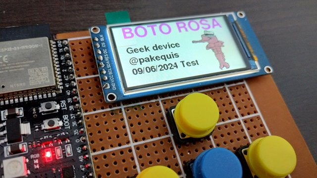

# **Boto-Rosa project logbook**

## 06/10/2024
- I started the menu lib.
- The Boto image was reduced to half its size in bytes, but retains the same resolution.

## 16/06/2024
- Small menu test, only to see the UI and test colors.

## 09/06/2024
- TFT LCD test - Splash screen with text and first project image logo (design by Julia T.).

## 02/06/2024
 - Initial commit with initial schematics and base firmware for test.
 - ESP32-S3 module, kebyboard and TFT LCD module were mounted on a perfboard.
 - I broke the LCD module during assembly and I had to replace it.
